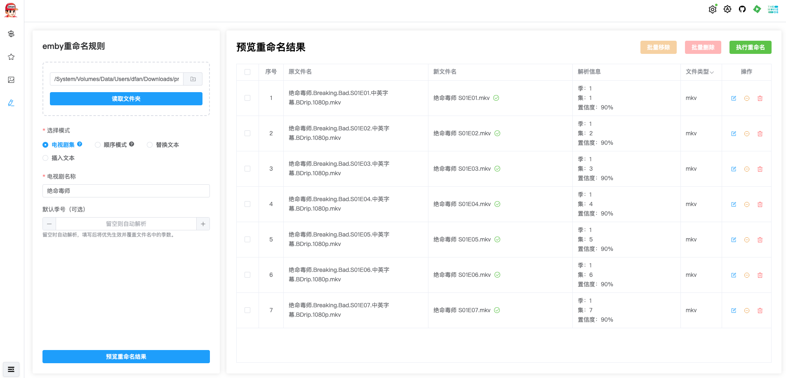

# emby-tools

<p align="center">
  
</p>
<h1 align="center">emby-tools</h1>

一个用于 Emby 周边工具的一体化跨平台应用，提供 Emby 登录与统计、TMDB 数据获取、随机海报生成、重命名与批量删除等能力。前端基于 Vue3 + Vite，后端基于 Node.js + Express。支持本地开发与 Docker 生产部署，生产模式下由后端托管前端静态资源。

## 核心功能

- 生成媒体库封面图
  - 图片来源可选 Emby 媒体库或 TMDB，支持随机抽取与预览
  - 一键替换 Emby 媒体封面，便于快速美化媒体库
- 批量重命名（剧集模式）
  - 自动识别文件名中的季、集信息（如 S01E02、01x02、中文季集等）
  - 统一规范输出格式，避免命名混乱，提升刮削与展示一致性
- Emby 数据面板
  - 媒体统计、最近新增、播放时长、存储占用等核心指标可视化
  - 便于了解媒体库规模与使用情况

## 功能预览

- Emby 概览与统计


- 每日推荐


- 媒体库海报替换与随机封面


- 文件工具：浏览/批量重命名/批量删除



## 功能使用说明

- Emby 数据面板（统计/最近新增/播放时长/存储占用）

  - 入口：首页。
  - 使用：点击右上角设置按钮，进入「Emby 连接设置」，填写 Emby 地址与账号密码并登录；登录成功后自动拉取指标。
  - 指标：
    - 媒体统计：电影/剧集/音乐数量及总计
    - 最近新增：名称、类型、封面
    - 播放时长：电影/剧集/音乐累计时长与总计（小时）
    - 存储占用：各类型体积、总计与磁盘容量

- 每日推荐（趋势/热门/高分、题材发现）

  - 入口：每日推荐。
  - 使用：查看今日推荐、热门剧集/电影、高分剧集/电影，数据来源 TMDB；点击卡片可跳转 TMDB 详情页。
  - 提示：TMDB 访问不畅时，点击右上角设置按钮进入「TMDB 代理设置」配置 http/https/socks 代理；留空则直连 TMDB。

- 生成媒体库封面图（来源 Emby/TMDB）

  - 入口：Emby 媒体库封面。
  - 功能要点：支持自定义背景色；图片来源可选 Emby 媒体库或 TMDB；可直接上传到 Emby 或下载本地。
  - 步骤：
    1. 选择媒体库
    2. 选择图片来源（默认 Emby，可改为 TMDB）
    3. 配置背景色与展示样式
    4. 生成封面并预览效果
    5. 选择「上传到 Emby」或「下载图片」
  - 提示：TMDB 访问不畅时，点击右上角设置按钮进入「TMDB 代理设置」配置 http/https/socks 代理；留空则直连 TMDB。

- 批量重命名

  - 入口：Emby 批量重命名。
  - 模式：电视剧集模式、顺序模式、替换文本模式、插入文本模式。
  - 识别：自动解析季/集信息，支持 S01E02、01x02、第 1 季第 2 集、1-02 等；可自动提取文件名中的关键字作为剧名/标题。
  - 规范示例：绝命毒师.S01E01.mkv（具体以界面显示为准）。
  - 步骤：
    1. 选择文件目录
    2. 选择重命名模式
    3. 输入剧集名称（或从文件夹名自动读取）
    4. 设置季号（剧集模式会尝试自动识别）
    5. 预览重命名结果，可逐条微调后执行
    6. 对多余文件可在表格中移除或选择永久删除
  - 建议：批量操作前建议对文件做一次备份；失败项会保留原名并显示错误原因。

## 项目结构

```
emby-tools/
├── frontend/          # Vue3 + Vite 前端项目
├── backend/           # Node.js + Express 后端项目
├── package.json       # 根目录脚本（并行启动前后端）
├── Dockerfile         # 一体化构建与运行
└── README.md          # 项目说明
```

## 环境要求

- Node.js 18+
- pnpm 包管理器
- Docker（可选，用于生产部署）

## 本地开发

1. 安装依赖

```bash
pnpm install:all
```

2. 启动前后端（并行）

```bash
pnpm dev
```

3. 访问

- 前端开发服务器：http://localhost:3000

说明：开发模式下前端由 Vite 独立运行，后端仅提供接口。生产模式下后端会托管前端打包产物。

## Docker 部署

方式一：本地构建镜像

```bash
docker build -t emby-tools-allinone .
docker run -d -p 3001:3001 --name emby-tools emby-tools-allinone
# 访问：http://localhost:3001
```

方式二：使用远程镜像

```bash
docker pull dfannn/emby-tools-allinone
docker run -d -p 3001:3001 --name emby-tools dfannn/emby-tools-allinone
# 访问：http://localhost:3001
```

## 常见问题

- TMDB 访问超时
  - TMDB 访问不畅时，点击右上角设置按钮进入「TMDB 代理设置」配置 http/https/socks 代理；留空则直连 TMDB，或检查网络 DNS/hosts 配置。
- 文件操作权限
  - 批量重命名/删除依赖容器内用户对挂载路径的权限，请确保挂载卷拥有读写权限。
